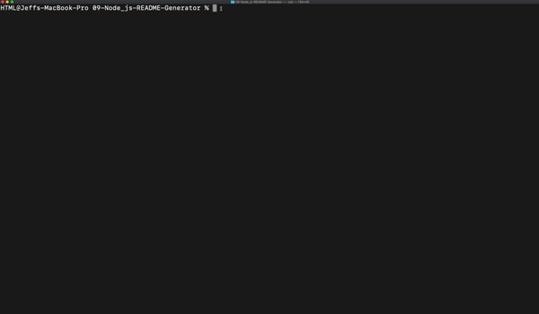

# README Generator

This is a README.md generator to provide a professional framework to any project. The effcient use of a Command Line Interface (CLI) increases the efficiency for any user when generating a README file. The application uses Inquirer to prompt the user with specific questions to fill in the README framework, once the user has answered all the questions the application does all the work for them.

# Table of Contents

|                               |                         |
| ----------------------------- | ----------------------- |
| [GitHub Links](#github-links) | [Questions](#questions) |
| [Installation](#installation) | [License](#license)     |
| [Test](#test)                 | [Credits](#credits)     |
| [Usage](#usage)               |                         |
|                               |                         |

# Installation

Open terminal/gitbash and run the following:

```
  npm install
```

## Test

Once installed, open terminal/gitbash and run the following:

```
  npm test
```

## Usage

To start the CLI please run the following in terminal/gitbash:

```
  node index.js
```

## Here is a preview of README Generator!



# GitHub Links

Deployed Project [Link](https://jeffcela.github.io/09-Node_js-README-Generator/)<br>
Project Repository [Link](https://github.com/jeffcela/09-Node_js-README-Generator)

## Questions

Please direct any questions to jeffcela@gmail.com

#Contributing
Please refer to each project's style and contribution guidelines for submitting patches and additions. In general, we follow the "fork-and-pull" Git workflow.

1. Fork the repo on GitHub
2. Clone the project to your own machine
3. Commit changes to your own branch
4. Push your work back up to your fork
5. Submit a Pull request so that we can review your changes

# Credits

_This homework assignment was completed in VS Code and Terminal by Jeff Cela on the day of 08/06/2021_
© 2021 Trilogy Education Services, LLC, a 2U, Inc. brand. Confidential and Proprietary. All Rights Reserved.

# License

[](https://shields.io)
